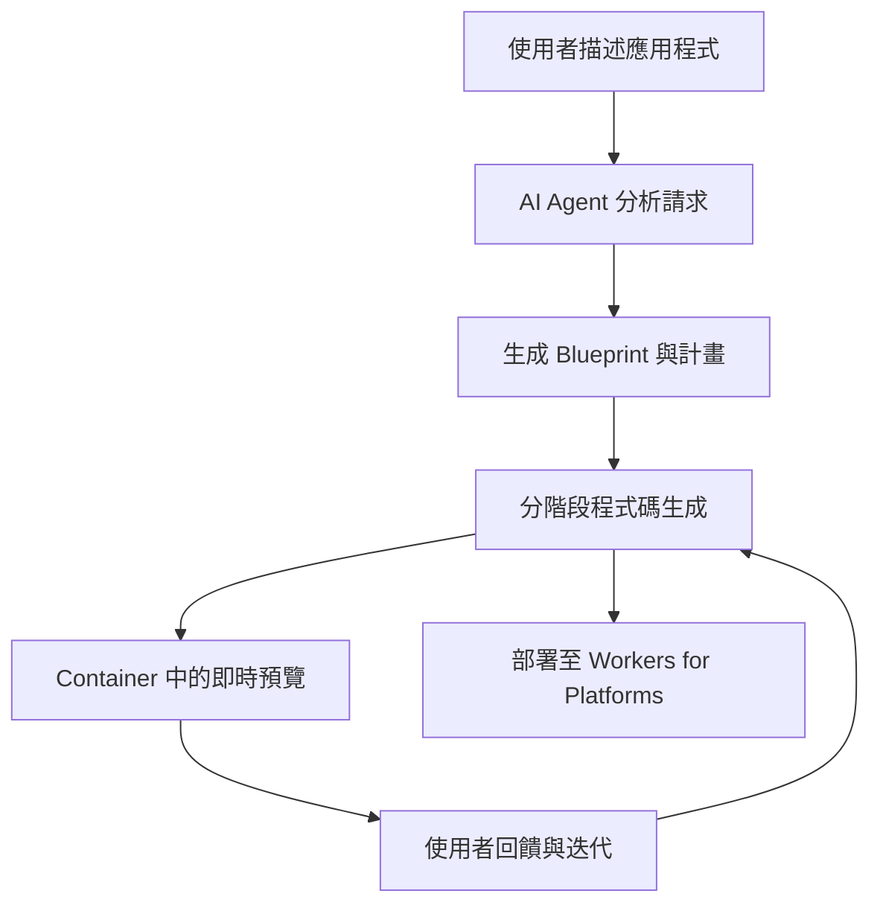

# 🧡 Cloudflare Vibe SDK

> **開源全端 AI webapp 生成器** – 部署您自己的 Cloudflare VibeSDK 實例，一個您可以自行運行和客製化的 AI vibe 編碼平台。

<div align="center">


## 🚀 線上展示

**[build.cloudflare.dev](https://build.cloudflare.dev)**

*在部署您自己的堆疊之前，先探索 VibeSDK Build。*

[](https://deploy.workers.cloudflare.com/?url=https://github.com/cloudflare/vibesdk)

**👆 點擊部署您自己的實例！**

*請遵循下方的設定指南來配置所需服務*

</div>

## Star History

[](https://www.star-history.com/#cloudflare/vibesdk&Date)

---

## ✨ 什麼是 Cloudflare VibeSDK？

Cloudflare VibeSDK 是一個建立在 Cloudflare 開發者平台上的開源 AI vibe 編碼平台。如果您正在建立一個用於構建應用程式的 AI 驅動平台，這是一個很好的範例，您可以部署並客製化以自行建立整個平台。平台部署後，使用者可以用自然語言描述他們想要建立的內容，AI agent 將會建立並部署應用程式。

**🌐 [在 build.cloudflare.dev 體驗線上版本](https://build.cloudflare.dev)** – 在部署您自己的實例之前先試用！

## 🎯 完美適用於

### 建立 AI 驅動平台的公司
運行您自己的解決方案，讓使用者能夠用自然語言建立應用程式。客製化 AI 行為、控制生成的程式碼模式、整合您自己的元件庫，並將所有客戶資料保留在您的基礎設施中。非常適合想要進入 AI 開發領域的新創公司，或是想要在現有開發者工具中新增 AI 功能的成熟公司。

### 內部開發
讓非技術團隊能夠建立他們需要的工具，無需等待工程資源。行銷部門可以建立 landing pages、業務部門可以建立自訂 dashboards，營運部門可以自動化工作流程，全部只需描述他們想要的內容。

### SaaS 平台
讓您的客戶擴展您產品的功能，無需學習您的 API 或撰寫程式碼。他們可以描述自訂整合、建立專門的工作流程，或建立符合其業務需求的客製化介面。

---

### 🎯 主要功能

🤖 **AI 程式碼生成** – 分階段開發，具備智慧錯誤修正
⚡ **即時預覽** – 在沙盒容器中運行的應用程式預覽
💬 **互動式 Chat** – 透過自然對話引導開發
📱 **現代化技術堆疊** – 生成 React + TypeScript + Tailwind 應用程式
🚀 **一鍵部署** – 將生成的應用程式部署至 Workers for Platforms
📦 **GitHub 整合** – 直接將程式碼匯出至您的 repositories

### 🏗️ 建立在 Cloudflare 平台上

Cloudflare VibeSDK Build 利用完整的 Cloudflare 開發者生態系統：

- **Frontend**：React + Vite 搭配現代化 UI 元件
- **Backend**：Workers 搭配 Durable Objects 用於 AI agents
- **Database**：D1 (SQLite) 搭配 Drizzle ORM
- **AI**：透過 AI Gateway 使用多個 LLM providers
- **Containers**：沙盒應用程式預覽和執行
- **Storage**：R2 buckets 用於 templates，KV 用於 sessions
- **Deployment**：Workers for Platforms 搭配 dispatch namespaces

## 📋 快速部署檢查清單

在點擊「Deploy to Cloudflare」之前，請準備好這些項目：

### ✅ 前置需求
- Cloudflare Workers Paid Plan
- Workers for Platforms 訂閱
- Advanced Certificate Manager（當您對應第一層子網域如 `abc.xyz.com` 時需要，以便 Cloudflare 可以為 `*.abc.xyz.com` 上的預覽應用程式發行所需的 wildcard 憑證）

### 🔑 必要的 API Key
- **Google Gemini API Key** - 從 [ai.google.dev](https://ai.google.dev) 取得

一旦您點擊「Deploy to Cloudflare」，您將被帶到 Cloudflare dashboard，在那裡您可以使用這些變數配置您的 VibeSDK 部署。

[](https://deploy.workers.cloudflare.com/?url=https://github.com/cloudflare/vibesdk)

### 🔑 您將配置的內容

- `GOOGLE_AI_STUDIO_API_KEY` - 您的 Google Gemini API key，用於 Gemini 模型
- `JWT_SECRET` - 用於 session 管理的安全隨機字串
- `WEBHOOK_SECRET` - Webhook 驗證 secret
- `SECRETS_ENCRYPTION_KEY` - Secrets 加密金鑰
- `SANDBOX_INSTANCE_TYPE` - Container 效能層級（選用，請參閱下方章節）
- `ALLOWED_EMAIL` - 允許使用應用程式的使用者電子郵件地址。這用於驗證使用者身分並防止未經授權的存取。
- `CUSTOM_DOMAIN` - 您在 Cloudflare 中配置的應用程式自訂網域（**必要**）。如果您使用第一層子網域如 `abc.xyz.com`，請確保該 zone 上的 Advanced Certificate Manager 附加元件已啟用。

### 自訂網域 DNS 設定

為了正確提供預覽應用程式，請在託管 `CUSTOM_DOMAIN` 的 zone 中新增以下 DNS 記錄：

- Type：`CNAME`
- Name：`*.abc`
- Target：`abc.xyz.com`（替換為您的基礎自訂網域或其他適當的來源）
- Proxy status：**Proxied**（橘色雲朵）

調整佔位符 `abc`/`xyz` 部分以符合您的網域。DNS 傳播需要時間 — 預期最多需要一小時才能解析預覽。此步驟可能會在未來版本中自動化，但目前是必要的。

### 🏗️ Sandbox Instance 配置（選用）

VibeSDK 使用 Cloudflare Containers 在隔離環境中運行生成的應用程式。您可以根據需求和 Cloudflare 方案配置容器效能層級。

#### 可用的 Instance Types

> **📢 2025 年 10 月更新**：Cloudflare 現在提供[更大的 container instance types](https://developers.cloudflare.com/changelog/2025-10-01-new-container-instance-types/)，具有更多資源！

| Instance Type | Memory | CPU | Disk | 使用情境 | 可用性 |
|---------------|--------|-----|------|----------|--------------|
| `lite` (別名：`dev`) | 256 MiB | 1/16 vCPU | 2 GB | 開發/測試 | 所有方案 |
| `standard-1` (別名：`standard`) | 4 GiB | 1/2 vCPU | 8 GB | 輕量正式環境應用程式 | 所有方案 |
| `standard-2` | 8 GiB | 1 vCPU | 12 GB | 中等工作負載 | 所有方案 |
| `standard-3` | 12 GiB | 2 vCPU | 16 GB | 正式環境應用程式 | 所有方案（**預設**）|
| `standard-4` | 12 GiB | 4 vCPU | 20 GB | 高效能應用程式 | 所有方案 |

#### 配置選項

**選項 A：透過 Deploy Button（建議）**
在「Deploy to Cloudflare」流程中，您可以將 instance type 設定為**建置變數**：
- 變數名稱：`SANDBOX_INSTANCE_TYPE`
- 建議值：
  - **Standard/付費使用者**：`standard-3`（預設，最佳平衡）
  - **高效能需求**：`standard-4`

**選項 B：透過環境變數**
對於本地部署或 CI/CD，設定環境變數：
```bash
export SANDBOX_INSTANCE_TYPE=standard-3  # 或 standard-4、standard-2、standard-1、lite
bun run deploy
```

#### Instance Type 選擇指南

**所有使用者：**
- **`standard-3`**（建議）- 正式環境應用程式的最佳平衡，具有 2 vCPU 和 12 GiB 記憶體
- **`standard-4`** - 運算密集型應用程式的最大效能，具有 4 vCPU

#### 這會影響什麼

`SANDBOX_INSTANCE_TYPE` 控制：
- **應用程式預覽效能** - 開發期間生成的應用程式運行速度
- **建置流程速度** - Container 編譯和建置時間
- **並行應用程式容量** - 可以同時運行多少個應用程式
- **資源可用性** - 複雜應用程式的記憶體和磁碟空間

> **💡 專業提示**：從 `standard-3`（新的預設值）開始，以獲得效能和資源的最佳平衡。如果您需要運算密集型應用程式的最大 CPU 效能，請升級至 `standard-4`。

### 🔗 部署後：OAuth 設定（選用）

OAuth 配置**不會**顯示在初始部署頁面上。如果您想要使用者登入功能，您需要在部署後進行設定：

**如何在部署後新增 OAuth：**
1. 在您的 GitHub/GitLab 帳號中**找到您的 repository**（由「Deploy to Cloudflare」流程建立）
2. **在本地 clone** 並執行 `bun install`
3. **建立 `.dev.vars` 和 `.prod.vars` 檔案**（請參閱下方的 OAuth 配置）
4. **執行 `bun run deploy`** 以更新您的部署

**Google OAuth 設定：**
1. [Google Cloud Console](https://console.cloud.google.com) → 建立專案
2. 啟用 **Google+ API**
3. 建立 **OAuth 2.0 Client ID**
4. 新增授權來源：`https://your-custom-domain.`
5. 新增重新導向 URI：`https://your-worker-name.workers.dev/api/auth/callback/google`
6. 新增至**兩個** `.dev.vars`（用於本地開發）和 `.prod.vars`（用於部署）：
   ```bash
   GOOGLE_CLIENT_ID="your-google-client-id"
   GOOGLE_CLIENT_SECRET="your-google-client-secret"
   ```

**GitHub OAuth 設定：**
1. GitHub → **Settings** → **Developer settings** → **OAuth Apps**
2. 點擊 **New OAuth App**
3. Application name：`Cloudflare VibeSDK`
4. Homepage URL：`https://your-worker-name.workers.dev`
5. Authorization callback URL：`https://your-worker-name.workers.dev/api/auth/callback/github`
6. 新增至**兩個** `.dev.vars`（用於本地開發）和 `.prod.vars`（用於部署）：
   ```bash
   GITHUB_CLIENT_ID="your-github-client-id"
   GITHUB_CLIENT_SECRET="your-github-client-secret"
   ```

**GitHub Export OAuth 設定：**
1. 建立一個單獨的 GitHub OAuth app（例如 `VibeSDK Export`）— 不要重複使用上面的登入 app。
2. Authorization callback URL：`https://your-worker-name.workers.dev/api/github-exporter/callback`（或您的自訂網域等效項）。
3. 新增至**兩個** `.dev.vars` 和 `.prod.vars`：
   ```bash
   GITHUB_EXPORTER_CLIENT_ID="your-export-client-id"
   GITHUB_EXPORTER_CLIENT_SECRET="your-export-client-secret"
   ```
4. 重新部署或重新啟動本地開發，以使新變數生效。


---
## 🎨 運作方式



### 運作方式

1. **🧠 AI 分析**：語言模型處理您的描述
2. **📋 Blueprint 建立**：規劃系統架構和檔案結構
3. **⚡ 階段生成**：透過相依性管理逐步生成程式碼
4. **🔍 品質保證**：自動化 linting、型別檢查和錯誤修正
5. **📱 即時預覽**：在隔離的 Cloudflare Containers 中執行應用程式
6. **🔄 即時迭代**：Chat 介面實現持續改進
7. **🚀 一鍵部署**：生成的應用程式部署至 Workers for Platforms

## 💡 試試這些範例提示

想看看這些提示的實際效果？**[先訪問 build.cloudflare.dev 的線上展示](https://build.cloudflare.dev)**，然後在部署後在您自己的實例上試試：

**🎮 有趣的應用程式**
> "建立一個具有拖放功能和深色模式的待辦事項清單"

> "建立一個具有不同筆刷大小和顏色的簡單繪圖應用程式"

> "製作一個使用表情符號的記憶卡片遊戲"

**📊 生產力應用程式**
> "建立一個具有圖表和類別的支出追蹤器"

> "建立一個具有任務管理的番茄鐘計時器"

> "製作一個具有連續記錄計數器的習慣追蹤器"

**🎨 創意工具**
> "建立一個從圖片生成調色盤的工具"

> "建立一個具有即時預覽的 markdown 編輯器"

> "製作一個具有文字覆蓋的迷因生成器"

**🛠️ 實用工具應用程式**
> "建立一個 QR code 生成器和掃描器"

> "建立一個具有自訂選項的密碼生成器"

> "製作一個具有點擊分析的 URL 縮短器"

---

## 🌍 架構深入探討

### 用於有狀態 AI Agents 的 Durable Objects
```typescript
class CodeGeneratorAgent extends DurableObject {
  async generateCode(prompt: string) {
    // 跨 WebSocket 連線的持久狀態
    // 具有錯誤恢復的分階段生成
    // 即時進度串流至前端
  }
}
```

### Workers for Platforms 部署
```javascript
// 生成的應用程式部署至 dispatch namespace
export default {
  async fetch(request, env) {
    const appId = extractAppId(request);
    const userApp = env.DISPATCHER.get(appId);
    return await userApp.fetch(request);
  }
};
```

### 基於迭代的程式碼生成
Cloudflare VibeSDK 以智慧階段生成應用程式：

1. **規劃階段**：分析需求，建立檔案結構
2. **基礎階段**：生成 package.json、基本設定檔案
3. **核心階段**：建立主要元件和邏輯
4. **樣式階段**：新增 CSS 和視覺設計
5. **整合階段**：連接 APIs 和外部服務
6. **最佳化階段**：效能改進和錯誤修正

---

## 部署後

- 「Deploy to Cloudflare」按鈕會佈建 worker，並在您的帳號中建立一個 GitHub repository。Clone 該 repository 以在本地工作。
- 推送至 `main` 分支會觸發自動部署；CI/CD 已為您設定好。
- 對於手動部署，複製 `.dev.vars.example` 至 `.prod.vars`，填入僅用於正式環境的 secrets，然後執行 `bun run deploy`。部署腳本會從 `.prod.vars` 讀取。

設定期間進行的 DNS 更新，包括上述的 wildcard CNAME 記錄，可能需要一段時間才能傳播。在測試預覽應用程式之前，請等待記錄解析完成。

---

## 🏠 本地開發

### 快速設定

您可以按照以下步驟在本地運行 VibeSDK：

```bash
# Clone repository
git clone https://github.com/cloudflare/vibesdk.git
cd vibesdk

# 安裝相依套件
npm install  # 或：bun install、yarn install、pnpm install

# 執行自動化設定
npm run setup  # 或：bun run setup
```

設定腳本將引導您完成：
- 安裝 Bun 以獲得更好的效能
- 配置 Cloudflare 憑證和資源
- 設定 AI providers 和 OAuth
- 建立開發和正式環境
- 資料庫設定和 migrations
- Template 部署

**[📖 完整設定指南](docs/setup.md)** - 詳細的設定說明和疑難排解

### 開發伺服器

設定完成後，啟動開發伺服器：

```bash
bun run dev
```

訪問 `http://localhost:5173` 以在本地存取 VibSDK。

### 正式環境部署

部署至 Cloudflare Workers：

```bash
bun run deploy  # 自動建置和部署（包含遠端 DB migration）
```

---

### 手動部署平台

#### 本地開發（.dev.vars）
1. 複製範例檔案：`cp .dev.vars.example .dev.vars`
2. 填入您的 API keys 和 tokens
3. 如果不需要，將選用值保留為 `"default"`

#### 正式環境部署
1. **建置變數**：在您的部署平台（GitHub Actions 等）中設定
2. **Worker Secrets**：由部署腳本自動處理或手動設定：
   ```bash
   wrangler secret put ANTHROPIC_API_KEY
   wrangler secret put OPENAI_API_KEY
   wrangler secret put GOOGLE_AI_STUDIO_API_KEY
   # ... 等等
   ```

#### 環境變數優先順序
部署系統遵循此優先順序：
1. **環境變數**（最高優先）
2. **wrangler.jsonc vars**
3. **預設值**（最低優先）

範例：如果 `MAX_SANDBOX_INSTANCES` 同時設定為環境變數（`export MAX_SANDBOX_INSTANCES=5`）和在 wrangler.jsonc 中（`"MAX_SANDBOX_INSTANCES": "2"`），將使用環境變數值（`5`）。

---

## 🔒 安全性與隱私

Cloudflare VibeSDK 實作企業級安全性：

- 🔐 **加密 Secrets**：所有 API keys 使用 Cloudflare 加密儲存
- 🏰 **沙盒執行**：生成的應用程式在完全隔離的容器中運行
- 🛡️ **輸入驗證**：所有使用者輸入都經過清理和驗證
- 🚨 **速率限制**：防止濫用並確保公平使用
- 🔍 **內容過濾**：AI 驅動的不當內容偵測
- 📝 **稽核日誌**：完整追蹤所有生成活動

---

## ❓ 疑難排解

### 常見部署問題

**🚫「Insufficient Permissions」錯誤**
- 驗證在部署期間自動處理
- 如果您看到此錯誤，請嘗試重新部署 - 權限會自動授予
- 如果問題持續存在，請聯絡 Cloudflare 支援

**🤖「AI Gateway Authentication Failed」**
- 確認 AI Gateway 設定為 **Authenticated** 模式
- 驗證驗證 token 具有 **Run** 權限
- 檢查 gateway URL 格式是否正確

**🗄️「Database Migration Failed」**
- D1 資源可能需要時間自動佈建
- 等待幾分鐘後重試 - 資源建立會自動處理
- 檢查您的帳號是否已啟用 D1 存取

**🔐「Missing Required Variables」**
- **Worker Secrets**：驗證所有必要的 secrets 都已設定：`ANTHROPIC_API_KEY`、`OPENAI_API_KEY`、`GOOGLE_AI_STUDIO_API_KEY`、`JWT_SECRET`
- **AI Gateway Token**：`CLOUDFLARE_AI_GATEWAY_TOKEN` 應同時設定為建置變數和 worker secret
- **環境變數**：這些會從 wrangler.jsonc 自動載入 - 無需手動設定
- **驗證**：API tokens 和 account IDs 由 Workers Builds 自動提供

**🤖「AI Gateway Not Found」**
- **使用 AI Gateway Token**：部署腳本應該會自動建立 gateway。檢查您的 token 是否具有 Read、Edit 和 **Run** 權限。
- **不使用 AI Gateway Token**：您必須在部署前手動建立 AI Gateway：
  1. 前往 [AI Gateway Dashboard](https://dash.cloudflare.com/ai/ai-gateway)
  2. 建立名為 `vibesdk-gateway` 的 gateway（或您的自訂名稱）
  3. 啟用驗證並建立具有 **Run** 權限的 token

**🏗️「Container Instance Type Issues」**
- **應用程式預覽緩慢**：嘗試從 `lite`/`standard-1` 升級至 `standard-3`（預設）或 `standard-4` instance type
- **記憶體不足錯誤**：升級至更高的 instance type（例如從 `standard-2` 升級至 `standard-3` 或 `standard-4`）或檢查生成的應用程式中的記憶體洩漏
- **建置逾時**：使用 `standard-3` 或 `standard-4` 以獲得更快的建置時間和更多 CPU 核心
- **使用舊版 types**：`dev` 和 `standard` 別名仍然有效，但分別對應至 `lite` 和 `standard-1`

### 需要協助？

- 📖 查看 [Cloudflare Workers Docs](https://developers.cloudflare.com/workers/)
- 💬 加入 [Cloudflare Discord](https://discord.gg/cloudflaredev)
- 🐛 在 [GitHub](https://github.com/your-org/cloudflare-vibecoding-starter-kit/issues) 上回報問題

---

## 🤝 貢獻

想要為 Cloudflare VibeSDK 做出貢獻？以下是方法：

1. **🍴 Fork** 透過 Deploy 按鈕（建立您自己的實例！）
2. **💻 開發**新功能或改進
3. **✅ 測試**使用 `bun run test` 進行徹底測試
4. **📤 提交** Pull Request 至主要 repository

---

## 📚 資源

### 🛠️ **Cloudflare 平台**
- [Workers](https://developers.cloudflare.com/workers/) - Serverless 運算平台
- [Durable Objects](https://developers.cloudflare.com/durable-objects/) - 有狀態 serverless objects
- [D1](https://developers.cloudflare.com/d1/) - Edge 上的 SQLite 資料庫
- [R2](https://developers.cloudflare.com/r2/) - 無 egress 費用的物件儲存
- [AI Gateway](https://developers.cloudflare.com/ai-gateway/) - 統一的 AI API gateway

### 💬 **社群**
- [Discord](https://discord.gg/cloudflaredev) - 即時聊天和支援
- [Community Forum](https://community.cloudflare.com/) - 技術討論
- [GitHub Discussions](https://github.com/your-org/cloudflare-vibecoding-starter-kit/discussions) - 功能請求和想法

### 🎓 **學習資源**
- [Workers Learning Path](https://developers.cloudflare.com/learning-paths/workers/) - 精通 Workers 開發
- [Full-Stack Guide](https://developers.cloudflare.com/pages/tutorials/build-a-blog-using-nuxt-and-sanity/) - 建立完整應用程式
- [AI Integration](https://developers.cloudflare.com/workers-ai/) - 在您的應用程式中新增 AI

---

## 📄 授權

MIT License - 詳見 [LICENSE](LICENSE)。
